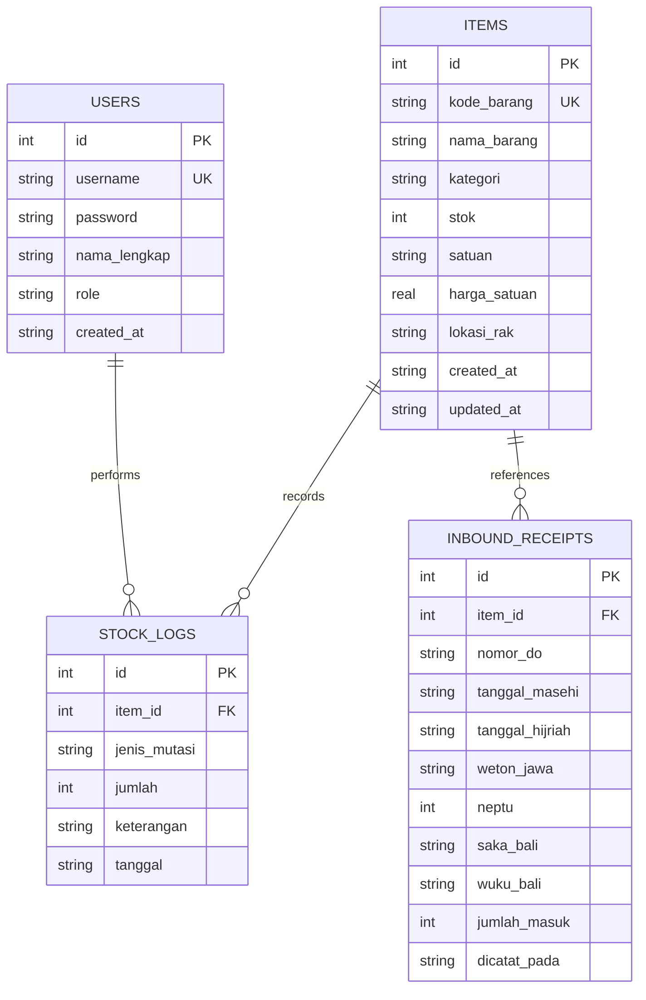

# PRODUCT REQUIREMENT DOCUMENT (PRD)
## Aplikasi Mobile "WarehouseSmart" (Manajemen Stok Gudang & Sistem Utilitas Terintegrasi)

---

### 📌 INFORMASI DOKUMEN & PROYEK
- **Nama Proyek**: WarehouseSmart Mobile App
- **Mata Kuliah**: Pemrograman Aplikasi Mobile
- **Jenis Penugasan**: Tugas Kelompok (3–4 Orang)
- **Versi Dokumen**: 2.2.0 (Revisi Stopwatch Split-Screen Fun Challenge & Kalkulator Umur Berbasis 00:00:00)
- **Tanggal Rilis Dokumen**: 16 September 2026
- **Target Platform**: Android (Flutter Framework)
- **Tim Pengembang (Kelompok)**:
  1. **Wilda Ghoniyu Jiddan** (NIM: 124240085) - *Lead Developer & Database Architect*
  2. **Rafid Ihsan Naufal** (NIM: 124240095) - *UI/UX Specialist & Date Conversion Module*
  3. **Bagus Fajjar Pambudi** (NIM: 124240108) - *Theme & Computation Logic Specialist*
  4. **Achmad Maulana** (NIM: 124240112) - *Session Auth, Stopwatch & Documentation Lead*

---

## 1. EXECUTIVE SUMMARY & LATAR BELAKANG

### 1.1 Latar Belakang
Pada pengembangan tahap awal (Tugas 1), telah dibangun purwarupa modul dasar kalkulasi stok dan operasi matematika gudang berbasis Flutter pada folder `aplikasi_stok_android/lib` yang mencakup 6 fitur:
1. Data Anggota Kelompok (`data_kelompok.dart`)
2. Penjumlahan & Pengurangan Stok (`penjumlahan_pengurangan.dart`)
3. Perkalian & Pembagian Kapasitas Rak (`perkalian_pembagian.dart`)
4. Analisis Ganjil/Genap Stok (`ganjil_genap.dart`)
5. Total Deret Angka Input (`total_angka.dart`)
6. Input Barang Baru (`input_barang.dart`)

Untuk memenuhi kriteria **Tugas 2 Pemrograman Aplikasi Mobile**, seluruh fitur yang sudah ada dipertahankan 100% tanpa mengubah logika dan kodenya, kemudian diintegrasikan ke dalam **Halaman Menu Utama Terpadu** bersama modul-modul baru yang disyaratkan:
- **Basis Data Lokal SQLite** (menggunakan package `sqflite`) untuk penyimpanan persisten (tanpa Firebase / cloud database terlebih dahulu).
- **Manajemen Sesi Pengguna (Session Login)** berbasis `shared_preferences`.
- **Bottom Navigation Bar 3 Menu**: (1) Beranda & Stopwatch, (2) Bantuan & Panduan, (3) Logout Sesi.
- **Konsep Penanggalan Logistik Penerimaan Barang**: Konversi penanggalan (Hijriah, Weton Jawa, Saka Bali) diintegrasikan dengan konteks **Pencatatan Tanggal Penerimaan Barang ke Gudang (Inbound Goods Receipt)**.
- **Konsep Terpadu Modul Umur & Waktu Detil (Berbasis Pukul 00:00:00)**: Pengguna **cukup menginput tanggal** (tanpa perlu repot menginput jam/menit). Perhitungan dimulai otomatis dari pukul **00:00:00** pada tanggal yang dipilih, menghasilkan konversi umur/durasi lengkap: **Tahun, Bulan, Hari, Jam, Menit, dan Detik secara realtime live ticker**. Disediakan dalam format **Dual-Mode**:
  1. *Mode Profil Staf Gudang*: Konversi Tanggal Lahir Karyawan ke Umur Detil (memenuhi kriteria resmi penugasan).
  2. *Mode Batch & Shelf Life Produk*: Menghitung durasi usia produk/batch sejak tanggal produksi (*Manufacture Date*) hingga detik ini.
- **Konsep Stopwatch "Fun Racking Challenge" (Split-Screen Duel 2 Pekerja)**: Stopwatch tidak hanya pengukur waktu biasa, melainkan fitur interaktif bernuansa **"FUN Challenge"** dengan **layar terbelah (split-screen)** untuk 2 pekerja gudang yang berlomba adu cepat menata barang ke rak gudang guna memperebutkan bonus reward!

### 1.2 Tema Aplikasi
**Tema: "Smart Logistics & Warehouse Inventory Management" (Manajemen Stok & Logistik Gudang Cerdas).**
Aplikasi menggunakan skema warna profesional logistik (*Industrial Steel Blue, Warehouse Amber, Clean Slate*), desain modern Material Design 3, dan akses *offline-first*.

---

## 2. TUJUAN & TARGET APLIKASI (PROJECT OBJECTIVES)

1. **Mempertahankan & Menampilkan Fitur Eksisting**:
   - Menampilkan seluruh 6 menu yang sudah ada di folder `lib/` pada Menu Utama tanpa mengubah fungsionalitas aslinya.
2. **Implementasi Basis Data Lokal SQLite**:
   - Menggunakan SQLite lokal (`sqflite`) untuk menyimpan akun pengguna, inventaris barang gudang persisten, log riwayat mutasi stok, dan riwayat penerimaan barang.
3. **Autentikasi & Manajemen Sesi**:
   - Login berbasis sesi (*session-based login*) dengan fitur auto-login dan logout yang membersihkan sesi.
4. **Konsep Modul Penanggalan Logistik (Penerimaan Barang)**:
   - Input tanggal penerimaan barang masuk ke gudang (*Inbound Goods Receipt Date*), yang secara otomatis dikonversi ke:
     - **Kalender Hijriah** (untuk sertifikasi halal, momentum distribusi Ramadhan/Idul Fitri/Idul Adha).
     - **Kalender Weton Jawa** (Hari Saptawara + Pasaran Pancawara + Perhitungan Neptu untuk jadwal pasar tradisional).
     - **Kalender Saka Bali** (Tahun Saka, Siklus 30 Wuku Bali, dan Sasih untuk logistik wilayah Bali dan penyesuaian hari raya adat).
5. **Konsep Modul Umur & Waktu Detil (Praktis Input Tanggal Berbasis Pukul 00:00:00)**:
   - Pengguna hanya perlu memilih tanggal lewat *DatePicker*.
   - Perhitungan otomatis dimulai dari **pukul 00:00:00** pada tanggal yang dipilih.
   - Hasil konversi presisi tinggi: **Tahun, Bulan, Hari, Jam, Menit, dan Detik** yang terus berdetak setiap 1 detik (*live realtime ticker*).
   - Mendukung Dual-Mode: Mode 1 (Usia Karyawan dari Tanggal Lahir) dan Mode 2 (Usia Batch/Masa Simpan Produk dari Tanggal Pembuatan).
6. **Konsep Stopwatch "Fun Racking Challenge" (Dual Split-Screen)**:
   - Layar terbagi dua (*split-screen*) untuk 2 pekerja gudang (Pekerja 1 vs Pekerja 2).
   - Menghitung kecepatan menata barang ke rak gudang secara adil dan kompetitif.
   - Kontrol mandiri untuk masing-masing pekerja (Start, Pause, Reset, Lap Time per Rak), tombol Duel Start bersama, serta kalkulasi selisih waktu otomatis untuk mengumumkan **Pemenang Bonus Gudang**.
7. **Integrasi Bottom Navigation Bar (3 Menu Wajib)**:
   - Menu 1: Beranda & Stopwatch Gudang.
   - Menu 2: Menu Bantuan / Panduan Lengkap.
   - Menu 3: Menu Logout dengan Dialog Konfirmasi.

---

## 3. ARSITEKTUR BASIS DATA (SQLITE PERSISTENCE)

Aplikasi menggunakan basis data relasional lokal **SQLite** (`sqflite: ^2.3.0` dan `path: ^1.8.3`). Seluruh data disimpan secara persisten di media penyimpanan lokal perangkat Android, sehingga tidak hilang saat aplikasi ditutup atau perangkat dimatikan.



### 3.1 Skema Tabel Basis Data SQLite

#### A. Tabel `users` (Manajemen Akun & Autentikasi)
```sql
CREATE TABLE users (
    id INTEGER PRIMARY KEY AUTOINCREMENT,
    username TEXT NOT NULL UNIQUE,
    password TEXT NOT NULL,
    nama_lengkap TEXT NOT NULL,
    role TEXT DEFAULT 'Staff Gudang',
    created_at TIMESTAMP DEFAULT CURRENT_TIMESTAMP
);
```
*Seeded Accounts (Bawaan)*:
- Username: `admin` | Password: `admin123` | Nama: `Administrator Gudang` | Role: `Super Admin`
- Username: `wilda` | Password: `password123` | Nama: `Wilda Ghoniyu Jiddan` | Role: `Lead Warehouse Officer`

#### B. Tabel `items` (Data Master Inventaris Barang)
```sql
CREATE TABLE items (
    id INTEGER PRIMARY KEY AUTOINCREMENT,
    kode_barang TEXT NOT NULL UNIQUE,
    nama_barang TEXT NOT NULL,
    kategori TEXT NOT NULL,
    stok INTEGER NOT NULL DEFAULT 0,
    satuan TEXT NOT NULL,
    harga_satuan REAL NOT NULL DEFAULT 0.0,
    lokasi_rak TEXT,
    created_at TIMESTAMP DEFAULT CURRENT_TIMESTAMP,
    updated_at TIMESTAMP DEFAULT CURRENT_TIMESTAMP
);
```

#### C. Tabel `stock_logs` (Audit Mutasi Stok Masuk & Keluar)
```sql
CREATE TABLE stock_logs (
    id INTEGER PRIMARY KEY AUTOINCREMENT,
    item_id INTEGER NOT NULL,
    jenis_mutasi TEXT NOT NULL, -- 'MASUK' atau 'KELUAR'
    jumlah INTEGER NOT NULL,
    keterangan TEXT,
    tanggal TIMESTAMP DEFAULT CURRENT_TIMESTAMP,
    FOREIGN KEY (item_id) REFERENCES items(id) ON DELETE CASCADE
);
```

#### D. Tabel `inbound_receipts` (Riwayat Penerimaan Barang & Penanggalan Budaya)
```sql
CREATE TABLE inbound_receipts (
    id INTEGER PRIMARY KEY AUTOINCREMENT,
    item_id INTEGER NOT NULL,
    nomor_do TEXT, -- Nomor Surat Jalan / Delivery Order
    tanggal_masehi TEXT NOT NULL, -- YYYY-MM-DD
    tanggal_hijriah TEXT NOT NULL,
    weton_jawa TEXT NOT NULL,
    neptu INTEGER NOT NULL,
    saka_bali TEXT NOT NULL,
    wuku_bali TEXT NOT NULL,
    jumlah_masuk INTEGER NOT NULL,
    dicatat_pada TIMESTAMP DEFAULT CURRENT_TIMESTAMP,
    FOREIGN KEY (item_id) REFERENCES items(id) ON DELETE CASCADE
);
```

---

## 4. STRUKTUR NAVIGASI & SUSUNAN MENU UTAMA

### 4.1 Hierarki Navigasi Keseluruhan

```mermaid
graph TD
    A[Aplikasi Dibuka / Startup] --> B{Pemeriksaan Sesi SharedPreferences}
    B -- Sesi Ditemukan --> D[Main Navigation Wrapper]
    B -- Belum Login / Sesi Kosong --> C[Halaman Login]
    C -- Login Berhasil & Simpan Sesi --> D

    subgraph "Bottom Navigation Bar (3 Menu)"
        D --> BN1[Tab 1: Beranda & Stopwatch]
        D --> BN2[Tab 2: Pusat Bantuan & FAQ]
        D --> BN3[Tab 3: Logout Sesi]
    end

    subgraph "Menu Utama (Beranda Terpadu)"
        BN1 --> Sec1["[BAGIAN A: MENU OPERASIONAL & MATEMATIKA EKSISTING]"]
        Sec1 --> M1[1. Data Anggota Kelompok]
        Sec1 --> M2[2. Penjumlahan & Pengurangan Stok]
        Sec1 --> M3[3. Perkalian & Pembagian Kapasitas Rak]
        Sec1 --> M4[4. Analisis Ganjil / Genap Stok]
        Sec1 --> M5[5. Total Angka dalam Field Input]
        Sec1 --> M6[6. Input Barang Baru Cepat]

        BN1 --> Sec2["[BAGIAN B: MENU FITUR BARU TUGAS 2]"]
        Sec2 --> M7[7. Manajemen Stok Gudang SQLite (CRUD & Audit Log)]
        Sec2 --> M8[8. Penanggalan Penerimaan Barang (Hijriah, Weton, Saka Bali)]
        Sec2 --> M9[9. Kalkulator Umur & Waktu Detil (Mulai Pukul 00:00:00)]
        Sec2 --> M10[10. Fun Racking Challenge: Stopwatch Split-Screen Duel]
    end

    BN3 -- Konfirmasi Logout 'Ya' --> C
```

### 4.2 Tata Letak Halaman Menu Utama (Beranda)

Tampilan Beranda mengelompokkan menu eksisting dan menu baru dengan tata letak yang bersih, elegan, dan fungsional:

```text
+-------------------------------------------------------------+
| [AppBar: WarehouseSmart]                       [Icon Logout]|
+-------------------------------------------------------------+
| [Banner: Halo, Administrator!]                              |
| Sistem Manajemen Stok Gudang & Utilitas Terintegrasi        |
+-------------------------------------------------------------+
| 📦 OPERASIONAL & MATEMATIKA DASAR (MENU EKSISTING)          |
| ----------------------------------------------------------- |
| [1] 👥  Data Kelompok                                       |
| [2] ➕➖ Penjumlahan & Pengurangan Stok                      |
| [3] ✖️➗ Perkalian & Pembagian Angka (Kapasitas Rak & Boks)  |
| [4] ⚖️  Analisis Ganjil / Genap Stok                         |
| [5] 🔢  Total Angka dalam Field Input                       |
| [6] 📝  Input Barang Baru (Form Registrasi)                 |
+-------------------------------------------------------------+
| 🚀 FITUR LANJUTAN & PENANGGALAN (TUGAS 2)                   |
| ----------------------------------------------------------- |
| [7] 🗄️  Manajemen Stok SQLite (CRUD Lengkap & Log Mutasi)   |
| [8] 📅  Penanggalan Terima Barang (Hijriah, Weton, Saka)    |
| [9] ⏳  Kalkulator Umur & Usia Batch (Mulai Pukul 00:00:00) |
| [10]⚡  Fun Racking Challenge (Stopwatch Duel 2 Pekerja)    |
+-------------------------------------------------------------+
| [Tab 1: Beranda & Stopwatch] | [Tab 2: Bantuan] | [Tab 3: Logout] |
+-------------------------------------------------------------+
```

---

## 5. SPESIFIKASI FITUR RINCI

### 🔑 MODUL 1: AUTENTIKASI & MANAJEMEN SESI (SESSION LOGIN)
- **FR-AUTH-01**: Form login dengan input Username, Password, toggle lihat sandi (*obscure toggle*), serta tombol aksi Login.
- **FR-AUTH-02**: Validasi kredensial login terhadap tabel `users` di basis data SQLite lokal.
- **FR-AUTH-03**: Saat login berhasil:
  - Menyimpan status sesi ke `SharedPreferences` (`is_logged_in = true`, `username`, `nama_lengkap`, `role`, `login_time`).
  - Mengarahkan pengguna langsung ke Menu Utama (*Navigation Wrapper*).
- **FR-AUTH-04**: *Auto-Login Startup*: Jika aplikasi dibuka kembali dan sesi di `SharedPreferences` masih valid, lewati halaman login dan langsung buka Beranda.
- **FR-AUTH-05**: Logout aman: Dialog konfirmasi *"Apakah Anda yakin ingin keluar?"*. Jika disetujui, bersihkan semua key sesi di `SharedPreferences` dan reset navigasi ke Halaman Login.

---

### 🧭 MODUL 2: BOTTOM NAVIGATION BAR (3 MENU WAJIB)

Sesuai kriteria wajib penugasan, bagian bawah layar menampilkan 3 menu navigasi permanen:

#### 1. Tab 1: Beranda & Stopwatch
- Menampilkan Halaman Utama terpadu yang memuat seluruh menu aplikasi.
- Menyediakan akses instan ke modul **Fun Racking Challenge / Stopwatch Gudang**.

#### 2. Tab 2: Menu Bantuan (Help & FAQ)
- Menampilkan panduan komprehensif bagi operator gudang:
  - Panduan login, logout, dan keamanan sesi.
  - Panduan operasi matematika dasar dan modul eksisting (Menu 1–6).
  - Panduan CRUD SQLite dan pencatatan mutasi stok masuk/keluar.
  - Penjelasan konversi tanggal penerimaan barang ke kalender Hijriah, Weton Jawa, dan Saka Bali.
  - Penjelasan kalkulator umur presisi detik yang dimulai otomatis dari pukul 00:00:00.
  - Panduan aturan kompetisi "Fun Racking Challenge" (Stopwatch Duel 2 Pekerja untuk bonus penataan rak).
  - FAQ (Tanya Jawab Kendala Teknis).

#### 3. Tab 3: Menu Logout
- Tombol aksi langsung pada bar bawah yang memunculkan dialog konfirmasi keluar.
- Menjamin pembersihan sesi secara tuntas dan mencegah navigasi kembali (*back navigation prevention*).

---

### 📦 MODUL 3: MENU OPERASIONAL & MATEMATIKA EKSISTING (BAGIAN A)

Seluruh 6 menu yang sudah dibangun pada penugasan sebelumnya dipertahankan tanpa perubahan kode:

1. **Menu 1: Data Kelompok (`HalamanDataKelompok`)**
   - Menampilkan profil 4 mahasiswa pengembang (Wilda, Rafid, Bagus, Maulana) beserta NIM.
2. **Menu 2: Penjumlahan & Pengurangan Stok (`HalamanPenjumlahanPengurangan`)**
   - Simulasi mutasi stok cepat: menambah barang masuk (+) dan mengurangi barang keluar (-).
3. **Menu 3: Perkalian & Pembagian Angka (`HalamanPerkalianPembagian`)**
   - Perhitungan jumlah total boks kardus (perkalian) dan kapasitas rak gudang (pembagian & sisa modulo).
4. **Menu 4: Analisis Ganjil / Genap Stok (`HalamanGanjilGenap`)**
   - Menganalisis apakah nilai kuantitas stok bernilai ganjil atau genap untuk penataan rak display.
5. **Menu 5: Total Angka dalam Field Input (`HalamanTotalAngka`)**
   - Menghitung jumlah akumulasi deret angka yang dimasukkan dalam satu field input.
6. **Menu 6: Input Barang Baru (`HalamanInputBarang`)**
   - Form pendaftaran barang baru dengan validasi data masukan.

---

### 🗄️ MODUL 4: MANAJEMEN INVENTARIS STOK SQLITE (CRUD LENGKAP)

Menyediakan antarmuka manajemen basis data relasional SQLite secara persisten:
- **Create (Tambah)**: Pendaftaran barang ke tabel `items` dengan Kode Barang (SKU), Nama, Kategori, Stok Awal, Satuan, Harga, dan Lokasi Rak.
- **Read (Lihat & Cari)**:
  - Tampilan daftar barang dalam bentuk Card dengan indikator warna status stok:
    - 🟢 *Stok Aman* (Stok > 20)
    - 🟡 *Stok Menipis* (Stok 6–20)
    - 🔴 *Stok Kritis/Habis* (Stok $\le$ 5)
  - Fitur pencarian realtime berdasarkan nama/kode barang.
  - Filter berdasarkan kategori (Sembako, Minuman, Makanan Ringan, Bumbu, dll.).
- **Update (Ubah Data & Mutasi)**:
  - Form edit rincian barang.
  - Operasi Cepat Mutasi: Tombol dialog `+ Tambah Stok` dan `- Kurang Stok` yang langsung mengupdate tabel `items` dan menambahkan riwayat mutasi ke tabel `stock_logs`.
- **Delete (Hapus)**: Menghapus data barang dengan dialog konfirmasi (*Undo/Batal*).
- **Log Riwayat**: Tab riwayat untuk melihat catatan mutasi stok (`stock_logs`) beserta waktu kejadian.

---

### 📅 MODUL 5: KONVERSI PENANGGALAN PENERIMAAN BARANG LOGISTIK
*(Konseptualisasi: Inbound Goods Receipt Cultural & Religious Calendar)*

#### A. Konsep Alur Penggunaan
Saat barang kiriman supplier tiba di gudang, petugas membuka formulir **Penerimaan Barang Masuk (Inbound Receipt)**:
1. Petugas memilih barang yang diterima dan menginput jumlah barang masuk.
2. Petugas memilih **Tanggal Penerimaan Barang** menggunakan *DatePicker* (format Masehi).
3. Sistem secara otomatis dan seketika melakukan konversi ke 3 sistem penanggalan:
   - **Kalender Hijriah (Islam)**
   - **Kalender Weton Jawa**
   - **Kalender Saka Bali**
4. Hasil konversi dapat disimpan ke tabel `inbound_receipts` di SQLite sebagai bukti audit barang masuk.

#### B. Output Konversi 1: Kalender Hijriah
- **Formula**: Algoritma konversi astronomi Ummul Qura / Tabular Islamic Calendar.
- **Hasil**:
  - Tanggal, Nama Bulan Hijriah (Muharram s/d Dzulhijjah), dan Tahun Hijriah (H).
  - Nama Hari dalam Bahasa Arab dan Indonesia (misal: *Al-Jum'ah / Jumat*).
  - Indikator Momentum Keagamaan (misal: Musim Ramadhan, Persiapan Lebaran, Musim Qurban, Puasa Sunnah Ayyamul Bidh) untuk perencanaan pasokan komoditas halal di gudang.

#### C. Output Konversi 2: Kalender Weton Jawa
- **Formula**:
  - Hari Saptawara (Senin, Selasa, Rabu, Kamis, Jumat, Sabtu, Minggu).
  - Hari Pancawara / Pasaran Jawa (Legi, Pahing, Pon, Wage, Kliwon).
  - Perhitungan Nilai Neptu:
    $$\text{Neptu Hari} + \text{Neptu Pasaran} = \text{Total Neptu}$$
- **Konteks Logistik**:
  - Di Indonesia (khususnya wilayah Jawa), perputaran rantai pasok pasar tradisional sangat bergantung pada hari pasaran (misal: Pasar Pon, Pasar Kliwon, Pasar Legi). Mengetahui weton tanggal kedatangan barang membantu manajer gudang mengatur jadwal bongkar muat dan distribusi ke pasar rakyat yang sedang ramai.

#### D. Output Konversi 3: Kalender Saka Bali
- **Formula**:
  - Tahun Saka (Tahun Masehi $- 78$).
  - Perhitungan 30 Wuku Bali (Sinta, Landep, Ukir, Kulantir, Tolu, Gumbreg, Wariga, dst.).
  - Penentuan Sasih (Kasa, Karo, Katiga, Kapat, Kalima, Kanem, Kapitu, Kawalu, Kasanga, Kadasa, Jyestha, Sadha).
- **Konteks Logistik**:
  - Penyesuaian jadwal logistik daerah Bali terkait hari raya suci keagamaan lokal (Galungan, Kuningan, dan terutama Hari Raya Nyepi saat seluruh aktivitas transportasi dan logistik off total).

---

### ⏳ MODUL 6: KALKULATOR UMUR & DURASI WAKTU PRESISI DETIK (BERBASIS PUKUL 00:00:00)
*(Konseptualisasi: Input Praktis Tanggal Saja, Perhitungan Realtime Mulai Pukul 00:00:00)*

#### A. Mekanisme Input Praktis (Tanpa Perlu Jam & Menit)
- Pengguna **hanya menginput tanggal** menggunakan *DatePicker* standar (misal: `15 Mei 2003`).
- **Aturan Acuan Waktu (Anchor Rule)**: Sistem secara otomatis menetapkan waktu awal perhitungan tepat pada **pukul 00:00:00** di tanggal yang dipilih (`DateTime(year, month, day, 0, 0, 0)`).
- **Hasil Konversi Presisi Tinggi**:
  - Selisih antara tanggal acuan (pukul 00:00:00) dengan waktu saat ini (`DateTime.now()`) diuraikan ke dalam komponen presisi:
    $$\text{Umur} = \text{X Tahun}, \text{ Y Bulan}, \text{ Z Hari}, \text{ H Jam}, \text{ M Menit}, \text{ S Detik}$$
  - Dilengkapi **Live Realtime Ticker**: Angka detik berdetak setiap **1 detik** secara otomatis tanpa perlu merefresh halaman!

```text
+-------------------------------------------------------------+
| ⏳ KALKULATOR UMUR & WAKTU DETIL (MULAI PUKUL 00:00:00)     |
| [ Segmented Button: (1) Profil Staf | (2) Batch Barang ]    |
+-------------------------------------------------------------+
| Input Tanggal: [ 15 Mei 2003 ] (Waktu otomatis 00:00:00)    |
|                                                             |
| Hasil Konversi Realtime:                                    |
|  >> 23 Tahun, 4 Bulan, 1 Hari, 19 Jam, 38 Menit, 42 Detik <<|
|  (Angka detik terus berdetak setiap detik!)                 |
|                                                             |
| Statistik Akumulasi:                                        |
| - Total Hari  : 8.525 Hari                                  |
| - Total Jam   : 204.619 Jam                                 |
| - Total Menit : 12.277.178 Menit                            |
| - Total Detik : 736.630.722 Detik                           |
|                                                             |
| 🎂 Countdown Ulang Tahun Berikutnya:                        |
|    242 Hari, 04 Jam, 21 Menit, 18 Detik Menuju Ultah!       |
+-------------------------------------------------------------+
```

#### B. Dual-Mode Konseptual
1. **Mode 1: Profil Usia Staf Gudang (Memenuhi 100% Kriteria Dosen)**:
   - Input: Nama Staf & Tanggal Lahir (mulai 00:00:00).
   - Output: Usia biologis staf lengkap (Tahun s/d Detik) + Countdown Ulang Tahun Berikutnya.
   - Relevansi: Administrasi HRD pergudangan, kelayakan fisik kerja, dan peringatan ulang tahun staf.
2. **Mode 2: Usia Batch & Masa Simpan Produk (*Shelf-Life Tracker*)**:
   - Input: Tanggal Pembuatan / Masuk Batch Produk (mulai 00:00:00).
   - Output: Lama durasi produk telah berada di fasilitas gudang presisi hingga detik ini.
   - Relevansi: Menjamin implementasi metode FIFO (*First In, First Out*) dan mencegah barang rusak/kedaluwarsa di rak.

---

### ⚡ MODUL 7: "FUN RACKING CHALLENGE" (STOPWATCH SPLIT-SCREEN DUEL 2 PEKERJA)
*(Konseptualisasi: Gamifikasi & Lomba Kecepatan Menata Rak Gudang Berhadiah Bonus)*

Untuk menghadirkan pengalaman yang seru dan fungsional di lingkungan kerja gudang, modul Stopwatch dirancang dengan konsep **"Fun Racking Challenge"** menggunakan tampilan **Layar Terbelah (Split-Screen)**:

```text
+-------------------------------------------------------------+
| ⚡ FUN RACKING CHALLENGE: DUEL PENATAAN RAK GUDANG          |
| Mode: [ (X) Split-Screen 2 Pekerja ]  [ ( ) Single Mode ]   |
+-------------------------------------------------------------+
| [🟡 PEKERJA 1: Slamet]                                      |
| Display:   00 : 02 : 15 . 42                                |
| [Mulai / Resume]  [Jeda / Pause]  [Catat Rak (Lap)]  [Reset]|
| Riwayat Rak:                                                |
| - Rak A1: 00:42.10 | Rak A2: 00:45.30 | Rak A3: 00:48.02    |
+-------------------------------------------------------------+
|               ⚡ TOMBOL: MULAI DUEL BERSAMA ⚡               |
+-------------------------------------------------------------+
| [🔵 PEKERJA 2: Budi]                                        |
| Display:   00 : 02 : 08 . 15                                |
| [Mulai / Resume]  [Jeda / Pause]  [Catat Rak (Lap)]  [Reset]|
| Riwayat Rak:                                                |
| - Rak A1: 00:40.05 | Rak A2: 00:43.20 | Rak A3: 00:44.90    |
+-------------------------------------------------------------+
| 🏆 HASIL DUEL: Budi Lebih Cepat 7.27 Detik!                 |
| 🎁 Pemenang Bonus Penataan Rak Gudang: BUDI!               |
+-------------------------------------------------------------+
```

#### A. Fitur Utama Split-Screen Duel
1. **Tampilan Split-Screen (Atas & Bawah)**:
   - Layar smartphone dibagi dua secara proporsional.
   - **Panel 1 (Pekerja 1 / Player A)**: Warna Industrial Amber/Kuning, display digital milidetik (`00:00:00.00`), input nama pekerja, dan kontrol tombol mandiri.
   - **Panel 2 (Pekerja 2 / Player B)**: Warna Industrial Blue/Biru, display digital milidetik (`00:00:00.00`), input nama pekerja, dan kontrol tombol mandiri.
2. **Sinkronisasi Duel ("Mulai Duel Bersama")**:
   - Terdapat tombol sentral *Mulai Bersama* dengan countdown singkat (3.. 2.. 1.. GO!) agar stopwatch kedua pekerja mulai berjalan serentak secara adil.
   - Namun masing-masing pekerja tetap dapat menekan Pause/Stop secara independen ketika selesai menata raknya.
3. **Catat Waktu Rak (Lap Time per Rak)**:
   - Tombol **Catat Rak (Lap)**: Menghitung waktu penyelesaian tiap baris/sektor rak (misal: Rak Sembako A, Rak Minuman B, Rak Bumbu C).
   - Menampilkan selisih waktu antar putaran lap.
4. **Kalkulator Selisih & Penentuan Pemenang Bonus**:
   - Ketika kedua pekerja menekan tombol Selesai/Stop, sistem secara otomatis:
     - Membandingkan total waktu Pekerja 1 vs Pekerja 2.
     - Menghitung **Delta Waktu (Selisih Kecepatan)**:
       $$\Delta t = |t_1 - t_2|$$
     - Menampilkan kartu pop-up selebrasi:  
       🏆 *"SELAMAT! Pekerja 2 (Budi) Menang dengan Keunggulan 7.27 Detik! Berhak Mendapatkan Bonus Penataan Rak!"*
5. **Dukungan Single Mode**:
   - Tersedia tombol toggle untuk beralih ke mode 1 stopwatch jika pekerja hanya ingin mengukur performa kerjanya sendiri tanpa lawan tanding.

---

## 6. KEBUTUHAN NON-FUNGSIONAL (NON-FUNCTIONAL REQUIREMENTS)

| Kategori | Parameter | Spesifikasi & Target |
| :--- | :--- | :--- |
| **Basis Data** | SQLite Local Storage | File database `warehouse_smart.db` persisten di penyimpanan lokal, transaksi ACID, query cepat (<50ms). |
| **Kinerja UI** | Responsivitas & Ticker | Berjalan mulus 60 FPS. Stopwatch ganda split-screen dan live ticker umur beroperasi efisien tanpa frame drops atau *memory leak*. |
| **Manajemen Sesi** | Keamanan Sesi | Status sesi tersimpan di `SharedPreferences`, auto-login saat startup, pembersihan sesi instan saat logout. |
| **Kompatibilitas** | Sistem Operasi | Android minimal versi 5.0 (API Level 21) hingga Android 14+ (API Level 34). |
| **Akses Offline** | Zero API Dependency | Seluruh operasi (CRUD SQLite, kalkulator tanggal, weton, hijriah, dual stopwatch) 100% offline tanpa membutuhkan internet. |
| **Estetika** | Desain Material 3 | Palet warna tema logistik modern, layout split-screen intuitif, kontras warna jelas untuk area gudang. |

---

## 7. STRUKTUR BERKAS PROYEK (`aplikasi_stok_android`)

Struktur proyek mempertahankan berkas eksisting di `lib/` dan menambahkan modul-modul baru secara modular:

```text
aplikasi_stok_android/
├── android/                             # Konfigurasi native Android
├── assets/                              # Gambar, logo, dan ikon
├── lib/
│   ├── main.dart                        # Entry Point, Multi-provider, Inisialisasi DB SQLite & Cek Sesi
│   │
│   │   # --- BERKAS MODUL EKSISTING (DIPERTAHANKAN 100%) ---
│   ├── beranda.dart                     # Halaman Menu Utama Terpadu (Menampilkan Menu Eksisting & Menu Baru)
│   ├── data_gudang.dart                 # Data Memori Awal & Informasi Anggota
│   ├── data_kelompok.dart               # [Eksisting] Menu 1: Data Anggota Kelompok
│   ├── penjumlahan_pengurangan.dart     # [Eksisting] Menu 2: Penjumlahan & Pengurangan Stok
│   ├── perkalian_pembagian.dart         # [Eksisting] Menu 3: Perkalian & Pembagian Kapasitas Rak
│   ├── ganjil_genap.dart                # [Eksisting] Menu 4: Cek Ganjil / Genap Stok
│   ├── total_angka.dart                 # [Eksisting] Menu 5: Total Angka dalam Input
│   ├── input_barang.dart                # [Eksisting] Menu 6: Input Barang Baru Cepat
│   │
│   │   # --- BERKAS MODUL BARU TUGAS 2 ---
│   ├── db/
│   │   ├── database_helper.dart         # Helper SQLite (Inisialisasi DB, Tabel, Operasi CRUD & Log)
│   │   └── session_manager.dart         # Pengelola Sesi SharedPreferences (Login, Sesi, Logout)
│   ├── models/
│   │   ├── user_model.dart              # Model Data Akun Pengguna
│   │   ├── item_model.dart              # Model Data Barang SQLite
│   │   ├── log_model.dart               # Model Data Log Mutasi Stok
│   │   └── receipt_model.dart           # Model Data Penerimaan Barang Masuk
│   ├── screens/
│   │   ├── main_navigation_screen.dart  # Wrapper Bottom Navigation Bar (3 Tab)
│   │   ├── stopwatch_screen.dart        # Modul Fun Racking Challenge (Dual Split-Screen Stopwatch & Single Mode)
│   │   ├── help_screen.dart             # Tab Bantuan & FAQ Dokumentasi
│   │   ├── sqlite_inventory_screen.dart # Modul CRUD SQLite Lengkap & Audit Log Mutasi
│   │   ├── goods_receipt_date_screen.dart # Modul Penanggalan Terima Barang (Hijriah, Weton, Saka Bali)
│   │   └── age_calculator_screen.dart   # Modul Kalkulator Umur Detil (Input Tanggal Saja Mulai 00:00:00)
│   └── utils/
│       ├── hijri_converter.dart         # Algoritma Penanggalan Hijriah Ummul Qura
│       ├── weton_converter.dart         # Algoritma Pasaran Pancawara & Perhitungan Neptu
│       └── saka_bali_converter.dart     # Algoritma 30 Wuku & Sasih Saka Bali
├── pubspec.yaml                         # Dependensi (sqflite, path, shared_preferences, intl)
└── README.md                            # Dokumentasi Proyek
```

---

## 8. MATRIKS PEMBAGIAN TUGAS KELOMPOK (WBS)

| Nama Mahasiswa | NIM | Peran Utama | Tanggung Jawab Modul |
| :--- | :--- | :--- | :--- |
| **Wilda Ghoniyu Jiddan** | 124240085 | *Lead Developer* & Database Architect | - Arsitektur basis data lokal SQLite (`DatabaseHelper`).<br>- Implementasi CRUD Stok SQLite & Pencatatan Log Mutasi.<br>- Integrasi Menu Utama Terpadu (`beranda.dart`) menghubungkan menu eksisting & baru. |
| **Rafid Ihsan Naufal** | 124240095 | UI/UX & Cultural Date Specialist | - Implementasi Modul Penanggalan Terima Barang Gudang.<br>- Algoritma Konversi Hijriah, Weton Jawa & Neptu, serta Saka Bali & Wuku.<br>- Desain responsif Material 3 dan visualisasi kartu tanggal. |
| **Bagus Fajjar Pambudi** | 124240108 | Theme & Dual-Mode Age Specialist | - Implementasi Modul Kalkulator Umur Detil (Logika Tanggal Saja Mulai Pukul 00:00:00).<br>- Logika Ticker Realtime 1 Detik & Hitung Mundur Ulang Tahun.<br>- Pemeliharaan modul matematika dan operasional eksisting (Menu 1–6). |
| **Achmad Maulana** | 124240112 | Session, Utility & Docs Lead | - Implementasi Autentikasi Login & Sesi (`SharedPreferences`).<br>- Implementasi Bottom Navigation Bar 3 Menu & Modul "Fun Racking Challenge" (Split-Screen Stopwatch Duel).<br>- Penyusunan Laporan Akademik SPADA dan panduan Bantuan (Help Screen). |

---

## 9. SISTEMATIKA LAPORAN AKADEMIK (SPADA COMPLIANCE)

Laporan akhir disusun untuk memenuhi kriteria evaluasi SPADA dengan format standar:

### COVER LAPORAN
- Judul: *Laporan Pembuatan Aplikasi Mobile: "WarehouseSmart - Sistem Manajemen Stok Gudang dan Utilitas Terintegrasi Berbasis Flutter dan SQLite"*
- Data Anggota Kelompok (4 Mahasiswa) & Dosen Pengampu.

### BAB I: PENDAHULUAN
- **1.1 Latar Belakang Masalah**: Otomasi rantai pasok gudang, efisiensi kerja pekerja lewat gamifikasi, dan kebutuhan integrasi multi-utilitas.
- **1.2 Rumusan Masalah**: Perancangan aplikasi mobile berbasis database SQLite, bersesi aman, berorientasi modul eksisting, bernuansa penanggalan logistik, dan dilengkapi fitur kompetisi kecepatan kerja.
- **1.3 Batasan Masalah**: Fitur-fitur yang tercakup sesuai kriteria tugas (SQLite, Session, 10 Menu Terpadu, Bottom Nav Bar, Stopwatch Split-Screen, Penanggalan Budaya & Religi, Usia Detik berbasis 00:00:00).
- **1.4 Tujuan & Manfaat**.

### BAB II: LANDASAN TEORI
- **2.1 Framework Flutter & Material 3**.
- **2.2 Basis Data Relasional Lokal (SQLite / sqflite)**.
- **2.3 Manajemen Sesi Pengguna pada Aplikasi Mobile (`shared_preferences`)**.
- **2.4 Sistem Penanggalan Astronomis & Budaya** (Kalender Hijriah, Siklus Pasaran & Neptu Jawa, serta Siklus Wuku & Sasih Saka Bali).
- **2.5 Teori Gamifikasi Operasional & Pengukuran Waktu Presisi (Stopwatch Lap Time & Racking Speed)**.

### BAB III: ANALISIS DAN PERANCANGAN SISTEM
- **3.1 Analisis Kebutuhan Fungsional & Non-Fungsional**.
- **3.2 Diagram Alur Sistem (Flowchart & Use Case Diagram)**.
- **3.3 Perancangan Basis Data SQLite (ERD & Kamus Data)**.
- **3.4 Perancangan Antarmuka Pengguna (UI Wireframe)**:
  - Wireframe Halaman Beranda (10 Menu Terpadu).
  - Wireframe Stopwatch Split-Screen Duel 2 Pekerja.
  - Wireframe Kalkulator Umur Live Ticker (Mulai 00:00:00).
  - Wireframe Penanggalan Terima Barang.

### BAB IV: IMPLEMENTASI DAN PEMBAHASAN
- **4.1 Lingkungan Pengembangan & Dependensi**.
- **4.2 Integrasi Modul Eksisting dengan Navigasi Terpadu**.
- **4.3 Implementasi Basis Data SQLite & Operasi CRUD**.
- **4.4 Implementasi Konversi Penanggalan Penerimaan Barang (Hijriah, Weton, Saka Bali)**.
- **4.5 Implementasi Kalkulator Umur Detil Berbasis Pukul 00:00:00 (Dual-Mode Staf & Batch Barang)**.
- **4.6 Implementasi "Fun Racking Challenge" (Stopwatch Split-Screen) & Bottom Navigation Bar**.
- **4.7 Pembahasan Kendala & Solusi Teknis**.

### BAB V: PENGUJIAN DAN EVALUASI
- **5.1 Tabel Pengujian Black Box Testing** (Login, Session Auto-Login, CRUD SQLite, Konversi Tanggal, Usia Detik 00:00:00, Stopwatch Split-Screen & Winner Detection, Logout).
- **5.2 Evaluasi Hasil Pengujian**.

### BAB VI: PENUTUP
- **6.1 Kesimpulan**.
- **6.2 Saran Pengembangan Lanjutan**.

### DAFTAR PUSTAKA & LAMPIRAN
- Tautan Repositori GitHub Proyek.
- Screenshot Tampilan Aplikasi Berjalan (*Running App Screenshots*).
- Logbook Catatan Kontribusi Individu Anggota Kelompok.

---

## 10. RENCANA PENGUJIAN (ACCEPTANCE CRITERIA)

| No | Kriteria Pengujian | Skenario Uji | Hasil yang Diharapkan | Status |
| :---: | :--- | :--- | :--- | :---: |
| 1 | **Database SQLite** | Tambah data barang di SQLite, tutup aplikasi paksa (*kill app*), lalu buka kembali. | Data barang tetap tersimpan persisten di SQLite lokal. | [ ] |
| 2 | **Preservasi Menu Eksisting** | Membuka Menu 1 s/d 6 eksisting dari Menu Utama. | Seluruh menu lama terbuka dan berfungsi normal tanpa ada error atau perubahan logika. | [ ] |
| 3 | **Session Login & Auto-Login** | Login dengan akun valid, tutup aplikasi, buka kembali. | Langsung masuk ke Beranda tanpa diminta login ulang. | [ ] |
| 4 | **Bottom Nav Bar (3 Tab)** | Berpindah antar Tab 1 (Beranda/Stopwatch), Tab 2 (Bantuan), Tab 3 (Logout). | Navigasi berjalan mulus dan status tab aktif bersesuaian. | [ ] |
| 5 | **CRUD Stok SQLite** | Menambah barang baru, mengubah data, mutasi stok (+/-), dan menghapus barang. | Tabel `items` dan `stock_logs` terupdate seketika di SQLite. | [ ] |
| 6 | **Penanggalan Terima Barang** | Input tanggal kedatangan barang (misal: 17 Agustus 1945). | Menghasilkan tanggal Hijriah (9 Ramadhan 1364 H), Weton Jawa (Jumat Legi, Neptu 11), dan Saka Bali secara simultan. | [ ] |
| 7 | **Kalkulator Umur (Mulai 00:00:00)** | Memilih tanggal (tanpa jam/menit). | Waktu mulai terhitung dari pukul 00:00:00 di tanggal tersebut, angka detik berjalan live setiap detik, format Tahun-Bulan-Hari-Jam-Menit-Detik akurat. | [ ] |
| 8 | **Stopwatch Split-Screen Duel** | Menekan "Mulai Duel Bersama", lalu Pekerja 1 dan Pekerja 2 menekan Stop pada waktu berbeda. | Kedua timer berjalan serentak, lap time tercatat per pekerja, dan sistem menampilkan pengumuman pemenang beserta selisih waktu bonus. | [ ] |
| 9 | **Stopwatch Single Mode** | Beralih ke Single Mode pada tab Stopwatch. | Menampilkan 1 stopwatch penuh untuk latihan mandiri dengan kontrol standar. | [ ] |
| 10 | **Logout & Clear Session** | Menekan tab Logout dan mengonfirmasi "Ya". | Sesi `SharedPreferences` terhapus total, dialihkan ke Halaman Login, tombol Back tidak bisa kembali ke Beranda. | [ ] |

---

## 11. TIMELINE & JADWAL PENYELESAIAN

| Fase | Kegiatan | Target Output |
| :--- | :--- | :---: |
| **Fase 1** | Finalisasi PRD.md & Setup Dependensi (`sqflite`, `shared_preferences`) | Dokumen PRD disetujui & dependensi siap |
| **Fase 2** | Implementasi SQLite (`DatabaseHelper`) & Session Login | Autentikasi dan tabel database aktif |
| **Fase 3** | Perakitan Menu Utama Terpadu & Bottom Navigation Bar (3 Menu) | Tampilan Beranda 10 Menu & 3 Tab Navigasi |
| **Fase 4** | Implementasi Modul Penanggalan Terima Barang (Hijriah, Weton, Saka Bali) | Modul konversi kalender budaya aktif |
| **Fase 5** | Implementasi Kalkulator Umur (00:00:00) & Stopwatch Split-Screen Duel | Live ticker umur & stopwatch kompetisi berfungsi |
| **Fase 6** | Pengujian Blackbox, Penyusunan Laporan SPADA, dan Slide Presentasi | Aplikasi teruji 100% & dokumen laporan siap kumpul |

---
*Dokumen ini dibuat dan disahkan sebagai acuan utama rekayasa perangkat lunak dalam pengerjaan Tugas 2 Pemrograman Aplikasi Mobile.*
